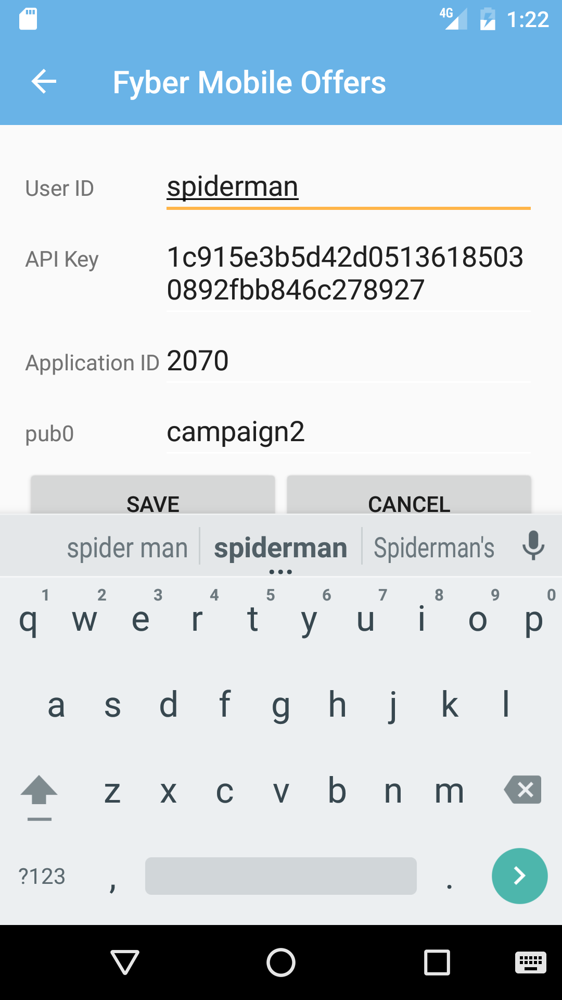
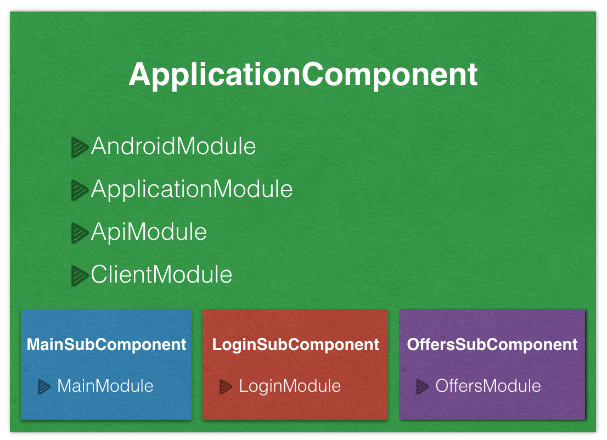

Fyber Mobile Offers Application
===============================

This repository holds the source code of the Fyber Mobile Offers Application, a simple Android client for the [Fyber.com](http://fyber.com).
This application was created by [Mohsen Mirhoseini Argi](http://mirhoseini.com), as part of the technical assessment by the [Fyber](http://fyber.com) team.

--------------------
### What is this repository for? ###

* Fyber Mobile Offers Application
*       Version:  1.0
* Last Update: Sat Oct 1, 2016

--------------------
### Development Tools ###

* Android Studio v2.2
* gradle-plugin v2.2.0
* Android SDK Build Tools v24.0.2
* MinSdkVersion 9
* CompileSDKVersion 24

--------------------
### Dependencies ###

* Android Support Tools (recyclerView, cardView, vector, palette,... ) v24.2.1
* Retrofit v2.1.0
* Okhttp v3.4.1
* Dagger v2.4
* RxJava v1.1.9
* RxAndroid v1.2.1
* Butterknife v8.0.1
* Timber v4.1.2
* AndroidUtils v1.0.1
* AppSettings v1.0.2
* jUnit v4.12
* Android Support Test v0.5
* Mockito v1.10.19
* Robolectric v3.1-rc1
* Espresso v2.2.2

--------------------
### Important Notes ###

The application has two Activity, Login and Main Activities. The Main Activity is responsible for presenting Offers List and will use Login Activity to load API key and other values.

All activity lifecycle and network behaviours are implemented, and according to device size and network situation user get a good UI and UX. In case having update cache data, app do not call Network. If no internet connection or network error, a dialog pops up and ask user to turn on network connection or retry.

Application network cache on Disk cause it work smooth and result a good UX.

Some simple Test Cases was designed to test application UI functionality and core classes using jUnit and AndroidUnitTest.

### Application Structure ###

The Application implemented and structured bases on the MVP pattern best practice, contributed by [Antonio Leiva](http://antonioleiva.com/mvp-android/).

Whole application functionality is implemented in "Core-Lib" module using pure Java. The "App" module contain all codes required for application to load on Android, which in this case can be replace by any other interface (like console app,...)

The view (MainActivity), contain a fragment. Offers fragment contain its own presenter and implement View interfaces and the only thing that the view will do is calling a method from the presenter every time there is an interface action.

The presenters (Offers, Main and Login Presenters), are responsible to act as the middle man between views and models. They retrieves data from the model and returns it formatted to the view. It also decides what happens when user interact with the view.

The models (Offers Interactor), would only be the gateway to the service domain layer or business logic. In this case it provide the data needed to be displayed in the view from Network, Google Play Services (AdsId) or cached data (SharedPreferences).

The networking and API call are managed by [Retrofit](http://square.github.io/retrofit/) and OkHttp as its httpclient, contributed by [Square](http://square.github.io). It also shows decent logs while application is running in Debug mode. The whole caching and offline interceptors are also implemented using these libraries. 

Layers communications are managed by [RxJava](https://github.com/ReactiveX/RxJava) & [RxAndroid](https://github.com/ReactiveX/RxAndroid) contributed by [ReactiveX](http://reactivex.io).

Dependency Injections are being managed by [Dagger](https://github.com/google/dagger) created by [Square](http://square.github.io) and now maintained by [Google](http://google.github.io/dagger/).

Some minor Android common functions are managed using [AndroidUtils](https://github.com/mmirhoseini/android_utils) library, and disk caching is also being managed using [AppSettings](https://github.com/mmirhoseini/app_settings) library, both developed and published on jCenter by [myself](http://mirhoseini.com).

Whole projects Dependencies are placed in "libraries.gradle" to avoid version conflicts and redundant in different modules.

Used new DataBinding library contributed by Google in Adapters for faster development, and added CustomBindingAdapter to handle downloading and caching images using [Picasso](http://square.github.io/picasso/) library, which also use google [Palette](https://developer.android.com/topic/libraries/support-library/features.html#v7-palette) support library as a helper class to extract prominent colors from image and making a related background for different CardViews.

The endless list is being handled using EndlessRecyclerViewScrollListener which wait for the end of the list and trigger the next page api call if there is more pages announce by previous api call.

The Android Log system is replaced with [Timber](https://github.com/JakeWharton/timber) contributed by Jake Wharton, which avoid logging in release version.

A general HashGenerator class generates the hash key required for calling API using all params and API key.

Google Ads ID and Limitation required for API received using GoogleAds class and kept in memory and also cached on disk to avoid complexity of calling Google Play Services methods for every network call.

Used new SupportVector library in some icons cases for a better UI.

Sample test cases are implemented by mockito, espresso, robolectric and mocking dagger.